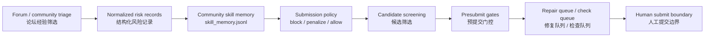

# WQ Community Skills

**Bilingual project / 双语项目**

This repository is a public, privacy-safe showcase of a **forum-to-agent-skill memory** design for WorldQuant-style alpha research agents.

这个仓库是一个公开、脱敏的展示项目，用来说明如何把 WQ Community / forum triage 中的经验蒸馏成 Agent 可使用的 **skill memory**：不是复制论坛公式，而是把经验转成 failure taxonomy、repair routes、submission gates 和 policy constraints。

> Educational and research use only. This repository is not affiliated with, endorsed by, or sponsored by WorldQuant or WorldQuant BRAIN. It does not contain real alpha expressions, private forum exports, credentials, or investment advice.

## What This Shows / 这个项目展示什么

Forum discussions can contain useful operational lessons, but using them directly is risky:

- snippets may be template clones;
- near-pass candidates may need repair rather than fresh generation;
- stale checks and pending correlation results should not be treated as submit-ready;
- unsupported operators, low-coverage fields, concentrated weights, and turnover issues need different repairs.

本项目展示的不是“从论坛抄 alpha”，而是：

1. 把帖子和评论 triage 成结构化 records；
2. 把 records 蒸馏成 reusable skills；
3. 把 skills 用作 gates、repair routes、risk flags；
4. 在 candidate generation / presubmit / repair queue 中约束 Agent；
5. 保留 human submit boundary。

The design is derived from the public architecture of [worldquant-harness](https://github.com/gyx09212214-prog/worldquant-harness), especially its community skill memory and forum-informed submission policy workflow.

## Core Principle / 核心原则

**Forum snippets are treated as grammar and failure evidence, not as directly submit-ready alpha expressions.**

**论坛片段只作为结构语法和失败经验，不作为可直接提交的 alpha 表达式。**

## CLI Quick Start / 命令行快速开始

This repository now includes a runnable Python CLI for two focused tasks:

1. **Near-pass repair evidence**: explain how to adjust candidates that are close to passing or blocked by a known failure type.
2. **Template acquisition**: fetch community/forum content and convert it into privacy-safe template skeletons.

本仓库现在包含一个可运行的 Python CLI，定位在两个具体能力：

1. **微调依据**：当 alpha 接近通过或卡在某类失败时，生成可解释的 repair route。
2. **模板一键获取**：只读拉取 Community/forum 内容，并抽象为脱敏 template skeleton。

Install locally:

```bash
python -m pip install -e ".[dev]"
```

Run the no-credential synthetic demo:

```bash
python -m wq_skill_pipeline demo
```

The demo writes private run artifacts to `~/.wq_skill_pipeline/runs/<run_id>` and public-safe artifacts to `artifacts/public/<run_id>`, including:

- `template_catalog.redacted.jsonl`
- `community_skill_memory.redacted.jsonl`
- `submission_policy.redacted.json`
- `near_pass_repair_suggestions.jsonl`
- `near_pass_repair_playbook.md`
- `review_report.html`
- `manifest.json`

Check the environment:

```bash
python -m wq_skill_pipeline doctor
```

For live readonly Community fetch, install the optional browser dependency and save a local Playwright login state:

```bash
python -m pip install -e ".[live]"
python -m playwright install chromium
python -m wq_skill_pipeline login
python -m wq_skill_pipeline run
```

The live connector is readonly. It does not include submit capability, and it does not write cookies, authorization headers, passwords, or account secrets into run artifacts.

Run only template extraction from local JSONL:

```bash
python -m wq_skill_pipeline templates fetch \
  --input-posts examples/community_posts.synthetic.jsonl \
  --output-dir .tmp/templates
```

Run only near-pass repair suggestions from local ledger/check artifacts:

```bash
python -m wq_skill_pipeline repair suggest \
  --ledger-root path/to/local/worldquant-harness/reports \
  --output-dir .tmp/repair
```

Public export is fail-closed: if the scanner sees likely credentials, raw platform payloads, long forum quotes, or executable alpha-expression patterns, public artifacts are not written.

Skills are used as:

- **gates**: block or penalize unsafe candidates;
- **repair routes**: choose the right next action after a failure;
- **risk flags**: carry template, correlation, turnover, coverage, unit, and stale-check risks into the harness;
- **policy constraints**: prefer fresh checks, low-correlation evidence, transformed field/operator families, and human submit boundaries.

## Skill Map / Skill 总览

### Main Routes / 主 route

| Skill | Role | Public-safe summary |
| --- | --- | --- |
| `community::near_pass_repair` | Near-pass repair route | Preserve the thesis first; choose metric overlay, settings grid, or family shift before spending fresh generation budget. |
| `community::alpha_template_transform` | Template transformation route | Treat forum templates as grammar only; require field-family or operator-family transformation plus orthogonal overlay. |
| `community::operation_attribution` | Failure attribution route | Diagnose turnover, unit, platform-limit, and availability failures before mutating expressions. |
| `community::submission_gate` | Submission safety route | Block stale checks, direct templates, unsupported operators, duplicates, and crowded families before submit review. |

### Selected Failure-Action Skills / 精选 failure-action skills

| Skill | Use When | First Action |
| --- | --- | --- |
| `community_failure::metric_near_pass_overlay_repair` | Metrics are close to threshold without correlation risk | Preserve thesis, reduce crowded trunk, add broad overlay, recheck. |
| `community_failure::correlation_near_pass_or_highscore_repair` | High-score or near-pass candidate fails self/prod correlation | Try settings grid, then field/operator-family shift. |
| `community_failure::correlation_similarity_block_or_family_shift` | Non-near-pass similarity or crowded family failure | Block current signature; require new source/field/operator family. |
| `community_failure::template_clone_blocker` | Candidate resembles public template or direct snippet | Block unchanged template; require transformation and overlay. |
| `community_failure::low_coverage_concentration_repair` | Sparse field family or low coverage dominates | Use tiny probes; add broad high-coverage leg. |
| `community_failure::turnover_density_repair` | Turnover or trade_when density is unstable | Tune smoothing, participation, and breadth together. |
| `community_failure::pending_check_not_submit_ready` | Correlation/precheck result is pending or stale | Keep in check queue only; refresh before submit review. |
| `community_failure::operator_platform_unit_probe` | Unit, operator, or platform support is uncertain | Run tiny legal-input probes; normalize with rank/scale/ratio. |
| `community_failure::ledger_duplicate_block` | Candidate is already submitted or exact duplicate | Block exact alpha; keep as ledger evidence only. |

For detailed bilingual notes, see [Community Skill Catalog](docs/COMMUNITY_SKILL_CATALOG.md).

## Workflow / 工作流



More detail: [Forum-to-Skill Workflow](docs/FORUM_TO_SKILL_WORKFLOW.md).

## Synthetic Examples / 脱敏伪例

This repository includes synthetic examples only:

- [community_skill_memory.synthetic.jsonl](examples/community_skill_memory.synthetic.jsonl)
- [submission_policy.synthetic.json](examples/submission_policy.synthetic.json)

These examples are intentionally non-executable. They use synthetic field families, synthetic source IDs, expression hashes, and risk flags. They do **not** include real alpha formulas or forum exports.

## Relationship To `worldquant-harness`

This showcase explains the public-safe idea behind the community skill layer used by [worldquant-harness](https://github.com/gyx09212214-prog/worldquant-harness):

- `community_skill_memory.py`: builds reusable skill memory from triage output.
- `wq_failure_taxonomy.py`: maps risk flags and failures to skill routes.
- `wq_forum_submission_optimizer.py`: converts skill memory into conservative submission policy.
- `wq_workflow_presubmit.py`: applies gates before submit review.

This repo is documentation-first. It does not copy private artifacts from the original research environment.

## Privacy And Safety / 隐私与安全

- No real alpha expressions.
- No raw forum text dumps.
- No account IDs, cookies, credentials, screenshots, or private exports.
- No claim of investment performance.
- No guarantee that any synthetic route produces a valid or profitable alpha.
- Not affiliated with WorldQuant or WorldQuant BRAIN.

See [Privacy and Safety](docs/PRIVACY_AND_SAFETY.md) and [Disclaimer](DISCLAIMER.md).

## License

MIT License. See [LICENSE](LICENSE).
