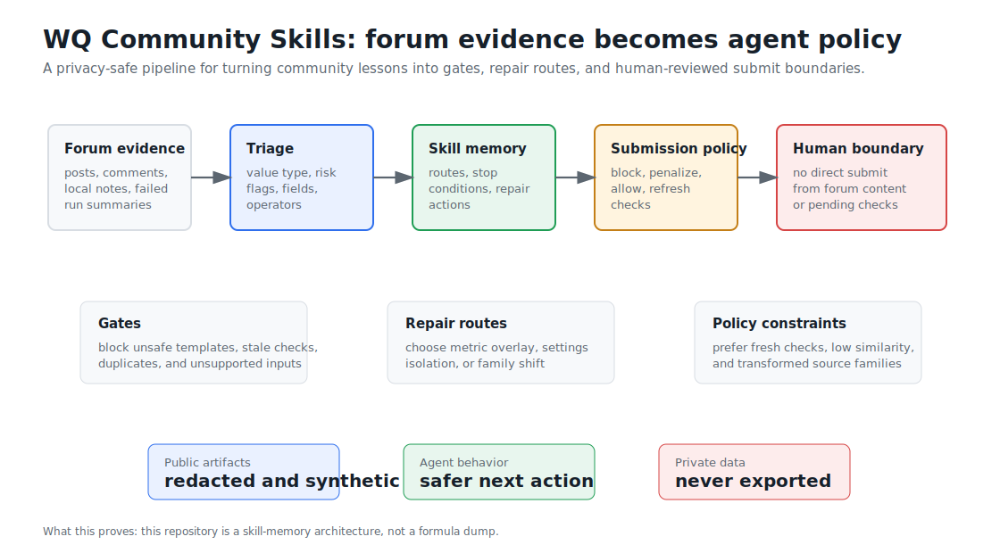
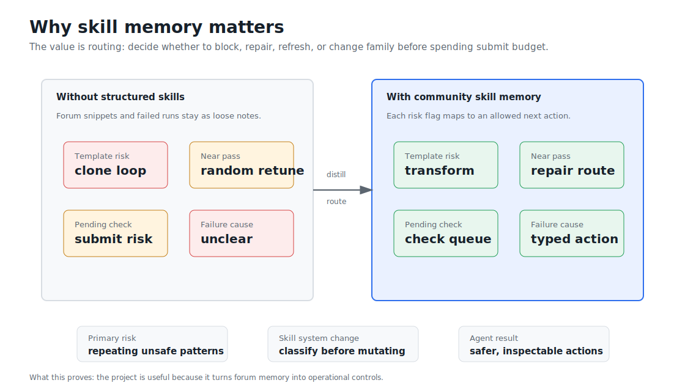
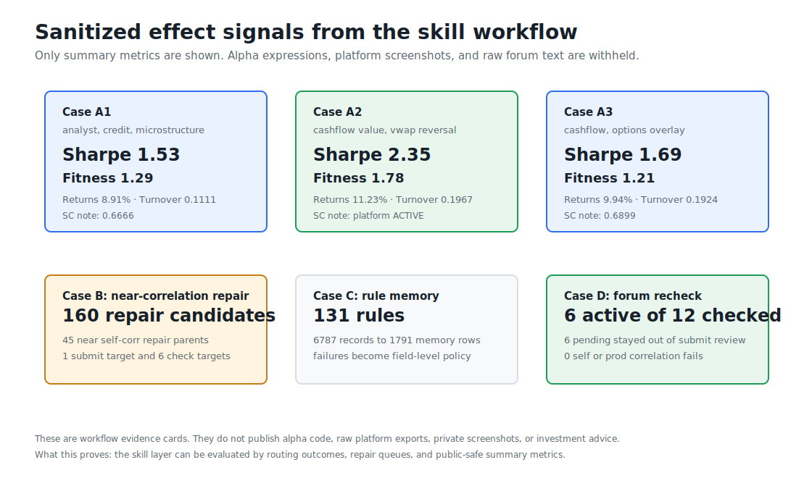
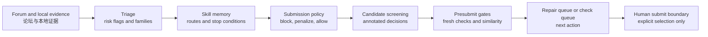
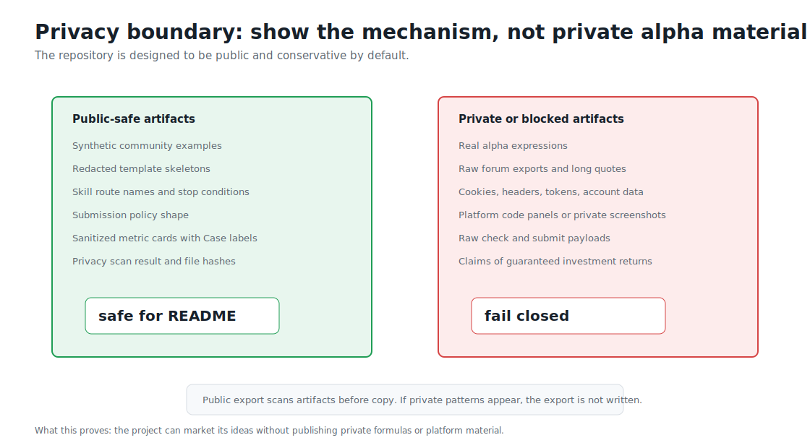

# WQ Community Skills

**Forum experience -> privacy-safe skill memory -> safer WQ-style agent research**

**双语项目 / Bilingual project**

This repository is a public showcase of a **forum-to-agent-skill memory** pipeline for WorldQuant-style alpha research agents. It does not publish formulas. It shows how community experience, failed submissions, near-pass repairs, and template risks can become reusable gates, repair routes, risk flags, and policy constraints.

这个仓库展示的是一套“论坛经验 -> Agent skill memory”的脱敏流程。它不是公式库，也不是平台截图合集；它的作用是把论坛经验、失败记录和微调复盘转成 Agent 能执行的门控、修复路线、风险标签和提交策略。

> Educational and research use only. This repository is not affiliated with, endorsed by, or sponsored by WorldQuant or WorldQuant BRAIN. It does not contain real alpha expressions, raw forum exports, credentials, private platform screenshots, or investment advice.

<p align="center">
  
</p>

## Why This Exists / 为什么需要它

Forum discussions can contain useful operational knowledge, but direct reuse is dangerous. Snippets may be template clones, near-pass candidates may need repair instead of random regeneration, pending checks are not submit-ready, and different failures require different next actions.

论坛经验有价值，但不能直接拿来提交。真正值得沉淀的是：什么时候该 block，什么时候该 repair，什么时候 refresh check，什么时候必须换字段族或算子族，什么时候必须停在人审边界前。

| Problem | Skill-memory response |
| --- | --- |
| Forum snippets can become clone risk | Treat templates as grammar only; require transformation before simulation |
| Near-pass candidates are easy to waste | Route them to metric overlay, settings isolation, or family shift |
| Pending or stale checks look tempting | Keep them in the check queue, not submit review |
| Failures are too coarse | Split them into actionable buckets with stop conditions |
| Agent context is fragile | Persist risk flags, skill routes, policy action, and repair hints |

<p align="center">
  
</p>

## What It Does / 它具体做什么

The pipeline turns community and local evidence into public-safe artifacts:

1. **Triage** posts, comments, and local records into value type, risk flags, field families, and operator families.
2. **Distill** records into `community::*` routes and refined `community_failure::*` action skills.
3. **Build policy** that can block, penalize, allow, or send candidates to a check queue.
4. **Suggest repairs** for near-pass and known failure patterns.
5. **Export public artifacts** only after privacy scanning.

这条链路的目标不是生成 alpha，而是给 Agent 一个更可靠的行动系统：把经验变成 route、gate、repair 和 policy。

## Public-Safe Effect Signals / 脱敏效果信号

The repository includes sanitized effect signals to explain why the skill system matters. These are workflow evidence cards, not trading advice and not performance guarantees.

<p align="center">
  
</p>

| Case | Public-safe signal | Distilled lesson |
| --- | --- | --- |
| Case A | One historical batch reached 10 ACTIVE outcomes | Successful repairs reduced crowded trunks and added structurally different overlays |
| Case B | 175 trajectories produced 45 near-correlation repair parents and 160 repair candidates | Strong parents near a correlation boundary should isolate settings effects before a full rewrite |
| Case C | 6787 records became 1791 memory rows and 131 rules | Submission experience should become field-level policy, not chat memory |
| Case D | Forum-derived recheck found 6 active and 6 pending from 12 checked | Forum evidence can help only after recheck, correlation review, and human selection |

See [Sanitized Case Studies](docs/CASE_STUDIES.md) and the machine-readable [sanitized metrics](examples/sanitized_case_metrics.json).

## Quick Start / 快速开始

Install locally:

```bash
python -m pip install -e ".[dev]"
```

Run the no-credential synthetic demo:

```bash
python -m wq_skill_pipeline demo
```

The demo writes private run artifacts to `~/.wq_skill_pipeline/runs/<run_id>` and public-safe artifacts to `artifacts/public/<run_id>`, including:

- `template_catalog.redacted.jsonl`
- `community_skill_memory.redacted.jsonl`
- `submission_policy.redacted.json`
- `near_pass_repair_suggestions.jsonl`
- `near_pass_repair_playbook.md`
- `review_report.html`
- `manifest.json`

Check the environment:

```bash
python -m wq_skill_pipeline doctor
```

Run only template extraction from local JSONL:

```bash
python -m wq_skill_pipeline templates fetch \
  --input-posts examples/community_posts.synthetic.jsonl \
  --output-dir .tmp/templates
```

Run only near-pass repair suggestions from local ledger or check artifacts:

```bash
python -m wq_skill_pipeline repair suggest \
  --ledger-root <local-harness-reports> \
  --output-dir .tmp/repair
```

For live readonly Community fetch, install the optional browser dependency and save a local Playwright login state:

```bash
python -m pip install -e ".[live]"
python -m playwright install chromium
python -m wq_skill_pipeline login
python -m wq_skill_pipeline run
```

The live connector is readonly. It has no submit capability and does not write cookies, authorization headers, passwords, or account secrets into run artifacts.

## Skill Map / Skill 总览

### Main Routes / 主 route

| Skill | Role | Public-safe summary |
| --- | --- | --- |
| `community::near_pass_repair` | Near-pass repair route | Preserve the thesis first; choose metric overlay, settings isolation, or family shift before spending fresh generation budget. |
| `community::alpha_template_transform` | Template transformation route | Treat forum templates as grammar only; require field-family or operator-family transformation plus an orthogonal overlay. |
| `community::operation_attribution` | Failure attribution route | Diagnose turnover, unit, platform-limit, and availability failures before mutating candidates. |
| `community::submission_gate` | Submission safety route | Block stale checks, direct templates, unsupported operators, duplicates, and crowded families before submit review. |

### Selected Failure-Action Skills / 精选 failure-action skills

| Skill | Use when | First action |
| --- | --- | --- |
| `community_failure::metric_near_pass_overlay_repair` | Metrics are close to threshold without correlation risk | Preserve thesis, reduce crowded trunk, add broad overlay, recheck. |
| `community_failure::correlation_near_pass_or_highscore_repair` | High-score or near-pass candidate fails self or production correlation | Try settings isolation, then field-family or operator-family shift. |
| `community_failure::correlation_similarity_block_or_family_shift` | Similarity failure is structural | Block current signature and require a new source, field, or operator family. |
| `community_failure::template_clone_blocker` | Candidate resembles a public template or direct snippet | Block unchanged template; require transformation and overlay. |
| `community_failure::low_coverage_concentration_repair` | Sparse field family or low coverage dominates | Use tiny probes; add broad high-coverage leg. |
| `community_failure::turnover_density_repair` | Turnover or trade density is unstable | Tune smoothing, participation, and breadth together. |
| `community_failure::pending_check_not_submit_ready` | Correlation or precheck result is pending or stale | Keep in check queue only; refresh before submit review. |
| `community_failure::operator_platform_unit_probe` | Unit, operator, or platform support is uncertain | Run tiny legal-input probes; normalize with rank, scale, or ratios. |
| `community_failure::ledger_duplicate_block` | Candidate is already submitted or exact duplicate | Block exact alpha; keep it as ledger evidence only. |

For detailed bilingual notes, see [Community Skill Catalog](docs/COMMUNITY_SKILL_CATALOG.md).

## Workflow / 工作流



More detail: [Forum-to-Skill Workflow](docs/FORUM_TO_SKILL_WORKFLOW.md).

## Privacy Boundary / 隐私边界

<p align="center">
  
</p>

Public export is fail-closed: if the scanner sees likely credentials, raw platform payloads, long forum quotes, or executable alpha-expression patterns, public artifacts are not written.

This repository includes:

- bilingual conceptual documentation;
- synthetic community examples;
- redacted skill memory shape;
- synthetic submission policy shape;
- sanitized case metrics and public-safe visuals.

This repository does not include:

- real alpha expressions;
- raw forum text dumps;
- account IDs, cookies, credentials, or session state;
- private platform screenshots or code panels;
- claims of guaranteed return or investment performance.

See [Privacy and Safety](docs/PRIVACY_AND_SAFETY.md) and [Disclaimer](DISCLAIMER.md).

## Relationship To `worldquant-harness`

This showcase explains the public-safe idea behind the community skill layer used by [worldquant-harness](https://github.com/gyx09212214-prog/worldquant-harness):

- `community_skill_memory.py`: builds reusable skill memory from triage output.
- `wq_failure_taxonomy.py`: maps risk flags and failures to skill routes.
- `wq_forum_submission_optimizer.py`: converts skill memory into conservative submission policy.
- `wq_workflow_presubmit.py`: applies gates before submit review.

This repo is documentation-first, but it also ships a runnable synthetic CLI so the artifact shapes can be inspected without credentials.

## License

MIT License. See [LICENSE](LICENSE).
