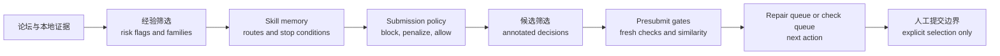

# WQ Community Skills

**论坛经验 -> 脱敏 skill memory -> 更安全的 WQ 风格 Agent 研究流程**

[English README](README.md)

这个仓库公开展示一套 **论坛经验到 Agent skill memory** 的转化流程。它不是公式库，也不发布私有平台截图；它展示的是如何把社区经验、提交失败、near-pass 微调和模板风险转成可复用的门控、修复路线、风险标签和策略约束。

> 仅用于教育和研究展示。本项目不隶属于 WorldQuant 或 WorldQuant BRAIN，也未获其背书或赞助。本仓库不包含真实 alpha 表达式、原始论坛导出、凭证、私有平台截图或投资建议。

<p align="center">
  
</p>

## 为什么需要它

论坛讨论里可能有有价值的操作经验，但直接复用很危险：片段可能变成模板克隆，near-pass 候选可能需要定向修复而不是随机重生成，pending check 不能当作 submit-ready，不同失败也需要不同下一步动作。

| 问题 | Skill-memory 处理方式 |
| --- | --- |
| 论坛片段可能带来克隆风险 | 只把模板当结构语法，模拟前必须做结构转换 |
| near-pass 候选容易被浪费 | 进入指标 overlay、settings 隔离或 family shift 路线 |
| pending 或 stale check 容易被误用 | 留在 check queue，不进入 submit review |
| 失败标签过粗 | 拆成带停止条件的可执行 action buckets |
| Agent 上下文容易丢失 | 持久化风险标签、skill 路线、策略动作和修复提示 |

<p align="center">
  
</p>

## 它具体做什么

这条链路把社区经验和本地运行证据转成可公开、可审计的脱敏产物：

1. **经验筛选**：把帖子、评论和本地记录整理成 value type、risk flags、field families 和 operator families。
2. **经验蒸馏**：把记录转成 `community::*` 主路线和更细的 `community_failure::*` 动作 skill。
3. **策略生成**：形成 block、penalize、allow 或进入 check queue 的策略。
4. **修复建议**：为 near-pass 和已知失败模式生成 repair route。
5. **公开导出**：只有隐私扫描通过后才写出 public artifacts。

目标不是直接生成 alpha，而是给 Agent 一个更可靠的行动系统：让经验变成 route、gate、repair 和 policy。

## 脱敏效果信号

本仓库包含脱敏后的效果信号，用来说明 skill system 为什么有用。这些是流程证据卡，不是交易建议，也不是收益保证。

<p align="center">
  
</p>

| 案例 | 脱敏信号 | 蒸馏出的经验 |
| --- | --- | --- |
| Case A | 某历史批次产生 10 个 ACTIVE 结果 | 有效修复不是单纯换窗口，而是降低拥挤主干并加入结构差异更大的 overlay |
| Case B | 175 条轨迹产出 45 个 near-correlation repair parents 和 160 个 repair candidates | 强 parent 接近相关性边界时，应先隔离 settings 效应，再决定是否重写结构 |
| Case C | 6787 条记录沉淀为 1791 条 memory rows 和 131 条 rules | 提交经验应该变成字段级策略，而不是停留在聊天记忆 |
| Case D | 论坛来源 recheck 中 12 个 checked 里有 6 个 active 和 6 个 pending | 论坛经验只有经过 recheck、相关性复核和人工选择后才有价值 |

详见 [脱敏案例复盘](docs/CASE_STUDIES.md) 和机器可读的 [脱敏指标](examples/sanitized_case_metrics.json)。

## 快速开始

本地安装：

```bash
python -m pip install -e ".[dev]"
```

运行无需凭证的合成 demo：

```bash
python -m wq_skill_pipeline demo
```

Demo 会把私有运行产物写入 `~/.wq_skill_pipeline/runs/<run_id>`，把可公开脱敏产物写入 `artifacts/public/<run_id>`，包括：

- `template_catalog.redacted.jsonl`
- `community_skill_memory.redacted.jsonl`
- `submission_policy.redacted.json`
- `near_pass_repair_suggestions.jsonl`
- `near_pass_repair_playbook.md`
- `review_report.html`
- `manifest.json`

检查环境：

```bash
python -m wq_skill_pipeline doctor
```

只从本地 JSONL 抽取模板骨架：

```bash
python -m wq_skill_pipeline templates fetch \
  --input-posts examples/community_posts.synthetic.jsonl \
  --output-dir .tmp/templates
```

只基于本地 ledger 或 check 产物生成 near-pass repair 建议：

```bash
python -m wq_skill_pipeline repair suggest \
  --ledger-root <local-harness-reports> \
  --output-dir .tmp/repair
```

如果要只读拉取 Community 内容，需要安装可选浏览器依赖，并保存本地 Playwright 登录状态：

```bash
python -m pip install -e ".[live]"
python -m playwright install chromium
python -m wq_skill_pipeline login
python -m wq_skill_pipeline run
```

Live connector 只读，不包含 submit 能力，也不会把 cookie、authorization header、密码或账号密钥写入运行产物。

## Skill 总览

### 主路线

| Skill | 作用 | 脱敏说明 |
| --- | --- | --- |
| `community::near_pass_repair` | near-pass 修复路线 | 先保留研究假设，再选择 metric overlay、settings 隔离或 family shift，避免直接消耗新生成预算。 |
| `community::alpha_template_transform` | 模板转换路线 | 论坛模板只当语法，必须更换字段族或算子族，并加入正交 overlay。 |
| `community::operation_attribution` | 失败归因路线 | 修改候选前先归因 turnover、unit、platform-limit 和 availability 问题。 |
| `community::submission_gate` | 提交安全门控 | 在 submit review 前阻断 stale check、直接模板、unsupported operator、duplicate 和 crowded family。 |

### 精选 failure-action skills

| Skill | 触发条件 | 第一动作 |
| --- | --- | --- |
| `community_failure::metric_near_pass_overlay_repair` | 指标接近阈值且相关性不是主问题 | 保留 thesis，降低拥挤主干，加入 broad overlay 后重新检查。 |
| `community_failure::correlation_near_pass_or_highscore_repair` | 高分或 near-pass 候选卡在 self/prod correlation | 先做 settings 隔离，再考虑字段族或算子族迁移。 |
| `community_failure::correlation_similarity_block_or_family_shift` | 相似性失败是结构性的 | 阻断当前 signature，要求更换 source、field 或 operator family。 |
| `community_failure::template_clone_blocker` | 候选像公开模板或直接片段 | 阻断未转换模板，要求结构转换和 overlay。 |
| `community_failure::low_coverage_concentration_repair` | 稀疏字段族或低覆盖字段占主导 | 先做小探针，再加入高覆盖 broad leg。 |
| `community_failure::turnover_density_repair` | turnover 或交易密度不稳定 | 同时调整 smoothing、participation 和 breadth。 |
| `community_failure::pending_check_not_submit_ready` | correlation 或 precheck 结果 pending/stale | 只放入 check queue，submit review 前必须刷新。 |
| `community_failure::operator_platform_unit_probe` | unit、operator 或平台支持不确定 | 运行小规模合法输入探针，并用 rank、scale 或 ratio 标准化。 |
| `community_failure::ledger_duplicate_block` | 候选已提交或完全重复 | 阻断 exact alpha，只作为 ledger evidence 保留。 |

更完整说明见 [Community Skill Catalog](docs/COMMUNITY_SKILL_CATALOG.md)。

## 工作流



更多细节见 [Forum-to-Skill Workflow](docs/FORUM_TO_SKILL_WORKFLOW.md)。

## 隐私边界

<p align="center">
  
</p>

公开导出采取 fail-closed 策略：如果扫描器发现疑似凭证、原始平台 payload、长论坛引用或可执行 alpha 表达式模式，就不会写出 public artifacts。

本仓库包含：

- 双语概念文档；
- 合成社区示例；
- 脱敏 skill memory 结构；
- 合成 submission policy 结构；
- 脱敏案例指标和 public-safe 视觉材料。

本仓库不包含：

- 真实 alpha 表达式；
- 原始论坛文本导出；
- 账号 ID、cookie、凭证或 session state；
- 私有平台截图或代码面板；
- 收益保证或投资表现承诺。

详见 [Privacy and Safety](docs/PRIVACY_AND_SAFETY.md) 和 [Disclaimer](DISCLAIMER.md)。

## 与 `worldquant-harness` 的关系

本仓库解释的是 [worldquant-harness](https://github.com/gyx09212214-prog/worldquant-harness) 中 community skill layer 的 public-safe 设计思想。

- `community_skill_memory.py`：从 triage output 构建可复用 skill memory。
- `wq_failure_taxonomy.py`：把 risk flags 和 failures 映射到 skill routes。
- `wq_forum_submission_optimizer.py`：把 skill memory 转成保守的 submission policy。
- `wq_workflow_presubmit.py`：在 submit review 前应用 gate。

本仓库以文档展示为主，同时提供可运行的合成 CLI，方便在没有凭证的情况下检查产物结构。

## 许可证

MIT 许可证。详见 [LICENSE](LICENSE)。
