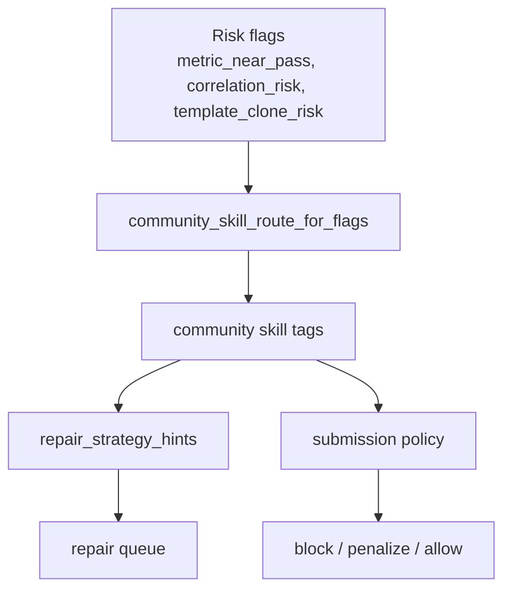

# Community Skill Catalog

This catalog describes the public-safe skill taxonomy used in this showcase.

本页整理脱敏后的 community skill 体系：它不是一组可提交公式，而是一组可被 Agent Harness 使用的 **gate / repair route / risk flag / policy constraint**。

## Reading Guide / 阅读方式

Each skill answers four questions:

1. **When to route here?** 什么时候进入这条 route？
2. **What should the agent do first?** Agent 第一动作是什么？
3. **What should be blocked?** 哪些行为应该阻止？
4. **How does this help research safety?** 它如何降低研究风险？

## Main Routes / 主 route

### `community::near_pass_repair`

**English:** Use this route when an idea is close to passing but fails one or two gates. The point is to preserve the research thesis before spending fresh exploration budget.

**中文：** 当候选接近过线但卡在少数 gate 上时，优先进入这条 route。核心不是重开一轮随机生成，而是先保留有效假设并做有针对性的修复。

- Route when: metric near-pass, correlation near-pass, almost passing public metrics.
- First actions: refresh precheck, settings grid, broad overlay, field-family change, operator-family change.
- Do not: only change lookback windows for correlation failures.
- Agent value: turns a failed run into a structured repair plan.

### `community::alpha_template_transform`

**English:** Use forum templates as structural grammar only. Before simulation, the candidate must change field family or operator family and add an orthogonal overlay.

**中文：** 论坛模板只能作为结构语法，不应直接提交。进入 simulation 前必须更换字段族或算子族，并增加正交 overlay。

- Route when: candidate seed, possible complete alpha, template clone risk.
- Required transform: field-family change, operator-family change, orthogonal overlay.
- Block: direct snippets, private code, unchanged public templates.
- Agent value: prevents public forum material from becoming direct clone risk.

### `community::operation_attribution`

**English:** Attribute platform failures before mutating. Different failures need different interventions.

**中文：** 先归因再修复。turnover、unit check、platform limit、operator availability 不能用同一种 mutation 处理。

- Route when: high/low turnover, unit check, platform limit, operator availability risk.
- Repair map: turnover -> decay/trade_when; unit check -> rank/scale/ratio; platform limit -> legal field/operator verification.
- Do not: mutate expressions before diagnosing the failure source.
- Agent value: turns forum experience into operational debugging knowledge.

### `community::submission_gate`

**English:** Gate submissions with forum-derived risk memory. A candidate with stale checks, unsupported operators, direct templates, duplicates, or crowded field family should not go straight to submit review.

**中文：** 用论坛蒸馏出的风险记忆做提交前门控。存在 stale check、unsupported operator、direct template、duplicate、crowded field family 的候选不能直接进入 submit review。

- Route when: correlation risk, stale precheck risk, field-family crowding, submission rule.
- Hard blocks: private code, direct template clone, unsupported operator.
- Preferred submit: fresh platform check, low self/prod correlation, diversified field family.
- Agent value: makes human submit review safer and more focused.

## Selected Failure-Action Skills / 精选 failure-action skills

### `community_failure::metric_near_pass_overlay_repair`

- Use when: LOW_SHARPE / LOW_FITNESS is near threshold and correlation is not the dominant issue.
- Action: preserve thesis, reduce crowded trunk, add one broad overlay, recheck metrics and correlation.
- Stop when: the candidate is no longer near-pass, overlay causes concentration, or field signature is blocked.
- Interview point: this shows the agent can repair rather than blindly regenerate.

### `community_failure::correlation_near_pass_or_highscore_repair`

- Use when: a high-score or near-pass candidate is blocked by self/prod correlation.
- Action: isolate settings effects first; if similarity is structural, change field or operator family.
- Stop when: correlation is far above cutoff, only windows changed, or no readable check exists.
- Interview point: correlation repair is not a prompt trick; it is a route with stop conditions.

### `community_failure::correlation_similarity_block_or_family_shift`

- Use when: similarity/correlation failure is not near-pass and looks structural.
- Action: block current signature, require new source family, field family, or operator skeleton.
- Stop when: no fresh check, no new field family, or template clone risk remains.
- Interview point: this protects the search process from repeatedly mining the same crowded region.

### `community_failure::template_clone_blocker`

- Use when: candidate resembles direct forum snippet, public template, course/homework-like answer, or private code.
- Action: withhold raw template, change field family, change operator family, add overlay.
- Stop when: private code, unchanged template, or similarity above cutoff.
- Interview point: forum knowledge is used as grammar and risk evidence, not as copied alpha.

### `community_failure::low_coverage_concentration_repair`

- Use when: low-coverage or sparse field family dominates the expression.
- Action: tiny probes first; add broad price-volume or model-dispersion leg before allocating budget.
- Stop when: concentration repeats or first probes fail coverage.
- Interview point: this connects forum experience to data-coverage risk, not just expression syntax.

### `community_failure::turnover_density_repair`

- Use when: high/low turnover, trade_when density, or event/news reactive fields are unstable.
- Action: tune smoothing and participation together; monitor turnover, long/short count, and breadth.
- Stop when: LOW_SUB_UNIVERSE appears after repair or metrics collapse after smoothing.
- Interview point: repair must preserve both signal quality and tradability constraints.

### `community_failure::pending_check_not_submit_ready`

- Use when: check/correlation evidence is pending, stale, or missing.
- Action: keep in check queue only; track pending age; refresh check.
- Stop when: pending is stale beyond run window or platform handle is missing.
- Interview point: pending is not pass. This is a simple but important human-boundary guardrail.

### `community_failure::operator_platform_unit_probe`

- Use when: unit check, unsupported operator, platform limit, or unknown support appears.
- Action: run tiny legal-input probes; normalize via rank/scale/ratio; stop unsupported operator family.
- Stop when: operator rejected twice, field unsupported, or unit cannot be normalized.
- Interview point: this is practical tool-interface design for a finance Agent.

### `community_failure::ledger_duplicate_block`

- Use when: candidate is already submitted, exact duplicate, or expression hash exists.
- Action: block exact alpha; keep as ledger evidence only; restart via new field/operator family.
- Stop when: already submitted or exact hash exists.
- Interview point: memory is used to avoid duplicate external actions.

## How Skills Are Used / Skill 如何进入系统

## Public-Safe Narrative / 面试叙事

> I distilled community/forum observations into routing skills. The system does not copy public formulas. It maps failure evidence into repair routes, gates, and policy constraints so the agent can decide whether to repair, refresh checks, change field family, or stop before submit review.

> 我把论坛经验蒸馏成 route skill，而不是公式库。系统用 failure evidence 指导修复、门控和提交策略，让 Agent 知道什么时候该 repair、什么时候该 refresh check、什么时候该换字段族、什么时候必须停在人审边界前。

