# Forum-to-Skill Workflow

This page explains how forum/community evidence becomes agent-usable skill memory.

本页说明论坛经验如何被转成 Agent 可执行的 skill memory。

## High-Level Flow / 总体流程

```mermaid
flowchart LR
  A["Community export<br/>posts/comments"] --> B["Triage<br/>value type, risk flags, fields, operators"]
  B --> C["Community skill memory<br/>main routes + failure-action routes"]
  C --> D["Submission policy<br/>hard block / penalize / allow"]
  D --> E["Candidate screening<br/>annotated with policy action"]
  E --> F["Presubmit gates<br/>fresh checks, correlation, similarity, thresholds"]
  F --> G["Repair queue / check queue<br/>next action"]
  G --> H["Human submit boundary<br/>explicit selection only"]
```



## 1. Triage / 经验筛选

The triage stage normalizes public or local community observations into compact records:

- value type: failure case, candidate seed, submission rule;
- experience category: near-pass repair, alpha template, operation attribution, submission gate;
- risk flags: metric near pass, correlation risk, template clone risk, stale precheck risk, unit check, platform limit;
- field/operator families;
- compact source metadata.

公开展示中不保留原始论坛正文、cookie、账号、平台导出或真实公式。triage 的价值是把零散经验变成结构化风险信号。

## 2. Skill Memory / Skill 记忆

Skill memory turns records into routes:

- `community::*`: stable, high-level routes for compatibility and readability.
- `community_failure::*`: refined action buckets for concrete failure modes.
- `forum_recipe::*`: optional public-safe recipe-level skills, only if transformed and supported by evidence.
- `community_candidate_family::*`: grouped seed-family memory, only after dedupe and transformation.

In the public showcase, examples are synthetic and non-executable.

## 3. Submission Policy / 提交策略

Skills are not used as candidate files. They are converted into a conservative policy:

- hard block unsupported/private/direct-template risks;
- block template clones unless there is field/operator-family transformation plus orthogonal overlay;
- penalize crowded or near-pass risks until fresh checks are available;
- route pending checks to the check queue, not submit review.

This is the key design choice: **skill memory informs gates and repair routes, not direct submission.**

## 4. Candidate Screening / 候选筛选

A candidate can be annotated as:

- `allow`: can continue to ordinary presubmit gates;
- `penalize`: can continue but receives risk labels and budget limits;
- `block`: must stop before simulation or submit review.

Typical block reasons:

- direct forum template risk;
- private code or unsupported source;
- exact duplicate or already submitted record;
- stale/pending check treated as submit-ready.

## 5. Presubmit And Repair / 预提交与修复

After policy screening, the harness still runs ordinary gates:

- metrics threshold;
- self/prod correlation;
- duplicate and similarity checks;
- turnover and breadth checks;
- field family capacity;
- platform readability.

Failures are routed back into repair queues through skill tags and failure taxonomy.

## Public-Safe Example / 脱敏示例

```text
Risk flags:
  metric_near_pass + correlation_risk

Routes:
  community::near_pass_repair
  community_failure::correlation_near_pass_or_highscore_repair

First actions:
  refresh check
  settings grid
  field-family or operator-family shift

Stop conditions:
  correlation far above cutoff
  only lookback window changed
  no readable check
```

No real alpha expression is needed to explain the route.

## Why This Matters / 为什么重要

For an agentic research system, memory should not be a chat summary. It should be actionable:

- route this candidate;
- block that unsafe path;
- repair this failure type;
- wait for a fresh check;
- ask a human before submit.

对投研 Agent 来说，真正有价值的 memory 不是“论坛上有人说过某个公式”，而是“出现某类失败时系统应该如何下一步行动”。

